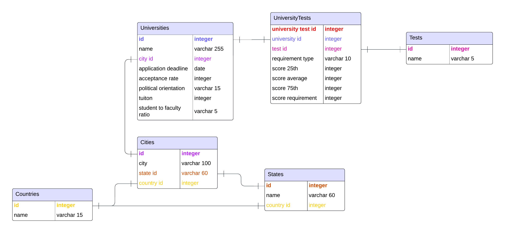

# College Applications Database

## Overview
This project is a PostgreSQL database designed to organize and manage data related to college applications. The database stores information about universities, application deadlines, test scores, and their requirements.

This is my first database project.

## Features
- **Universities**: Stores details about universities such as location, acceptance rate, and student to faculty ratio.
- **Tests**: Keeps track of standardized tests like the SAT, IELTS, and TOEFL.
- **Applications**: Links universities with applications, tracking deadlines and statuses.
- **Flexible Test Requirements**: Handles differing test requirements

## Database Schema
The database consists of the following tables:
1. **universities**
2. **tests**
3. **universities_tests**
4. **applications**
5. **cities**
6. **states**
7. **countries**



## Getting Started
### Prerequisites
- PostgreSQL installed on your machine.

### Installation
1. Clone this repository:
   ```bash
   git clone https://github.com/yourusername/college_applications_db.git
   cd college_applications_db
2. Create the database:
   ```bash
   createdb college_applications_db

